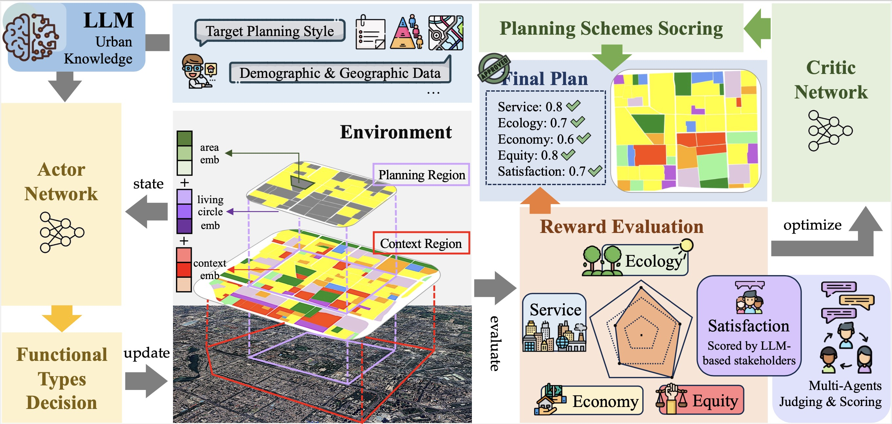
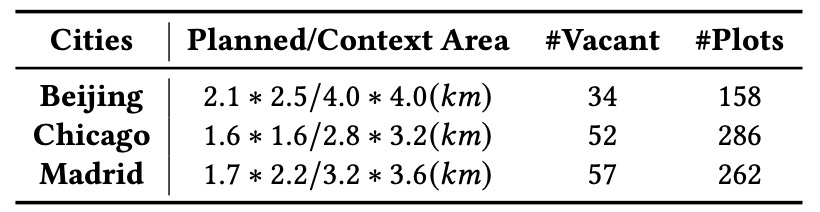
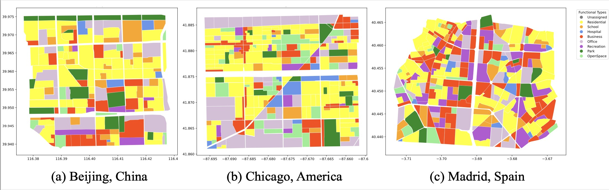
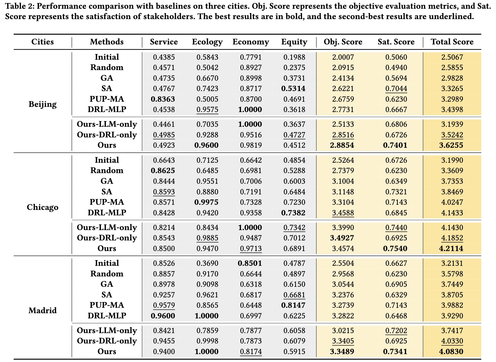
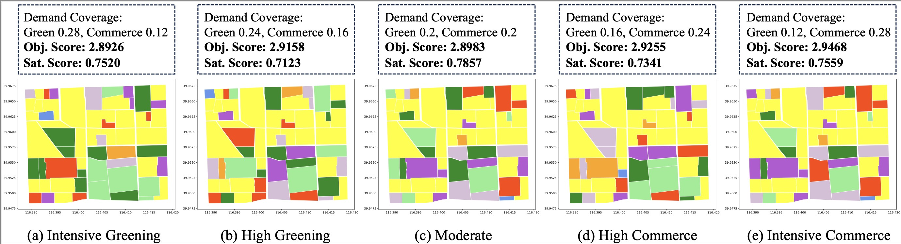
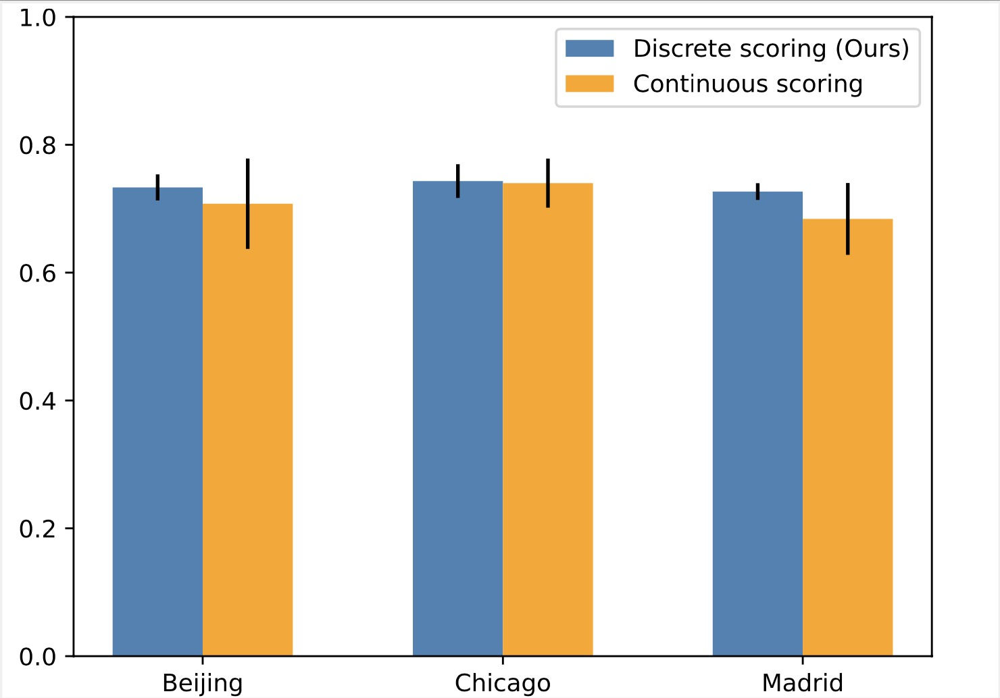

# Intelli-Planner

The repo is the official implementation for our KDD2024 submission: **Intelli-Planner: Towards Stylized Urban Planning via Large Language Model Empowered Reinforcement Learning**.

## Overview



To integrate the world knowledge capabilities of large language model (LLM) with the search proficiency of reinforcement learning (RL), we propose a **stylized urban planning framework**. This framework, based on the Actor-Critic (AC) paradigm, utilizes LLM for planning objectives formulation, enhances policy network through single-agent guidance, and obtains schemes satisfying various stakeholders through multi-agents scoring. Additionally, we introduce a five-dimensional evaluation system for a comprehensive and detailed quantification assessment of the final planning scheme.

Specifically, the high-level objectives are first provided by LLM based on the given planning style and basic demographic and geographic statistical data of the community. Then, we train our Intelli-Planner through RL enhanced with LLM’s knowledge to learn according to the given objectives. We propose a five-dimensional evaluation system to measure the quality of the final scheme, including *service*, *ecology*, *economy*, *equity*, and *satisfaction* with simulated different stakeholders. The ultimate framework achieves outstanding planning outcomes in three communities with different styles in Beijing, Chicago, and Madrid.

## Data

- The land parcels data in **Beijing, Chicago and Madrid** used in this paper are in `\data`.
- Or you can select the community block of your interest using OpenStreetMap (OSM), QGIS, or other software, and call `\utils\data_preprocessing.py` for preprocessing. The visualization of plots can be rendered by calling `\utils\visualize_regions.py`.





## Usage

#### Environment

- Python >= 3.9
- torch == 2.1.0 + cu118

#### Dependencies

1. Install Pytorch with the correct CUDA version.
2. Use the `pip install -r requirements.txt` command to install all of the Python modules and packages used in this project.

#### Model Training and Inference

1. Add your OPENAI API KEY into `\LLM\agent.py`.

2. Here, we take the Beijing community as an example for model training.

   a. Combined with the demographic and geographic statistics of Beijing's community, as well as our desired planning style, we can obtaine the planning objectives for each functional type. See the last section for specific prompts.

   b. Modify the `'shp_file_path'`, `'geo_info_path'`, and `'city_name'`  in the `'train.py'` file to BEIJING.

   c. Fill in our planning goals in the `envs/urban_config.py`.

   ```
   python train.py
   ```


3. Finally, we were able to get the final planning results and indicators in the `\ckpt` folder.

## Results

The table below illustrates the results of our framework's planning in three neighborhoods: Beijing, Chicago, and Madrid. (**Compared with the original paper, we have added two new baselines, PUP-MA and DRL-MLP**)



- **PUP- MA**：Participatory urban planning based on multi-agent collaboration [1]. We simplify the number of agents in the original literature to consider one planner and three different stakeholders interacting with each other. This is a purely LLM-based baseline model, and we utilize GPT-3.5 as our API call interface.
- **DRL-MLP**：Spatial urban planning based on reinforcement learning [2]. Since the road network we consider is fixed, it is difficult to utilize the graph neural network for training. Therefore, we compare our method with the DRL based on multilayer perceptron mentioned in the literature.

> [1] Zhou Z, Lin Y, Jin D, et al. Large Language Model for Participatory Urban Planning[J]. arXiv preprint arXiv:2402.17161, 2024.
>
> [2] Zheng Y, Lin Y, Zhao L, et al. Spatial planning of urban communities via deep reinforcement learning[J]. Nature Computational Science, 2023, 3(9): 748-762.

We set different planning styles in the Beijing community to generate planning schemes based on various demand orientations:



We evaluate the stability of satisfaction ratings for stakeholders based on LLM. Our framework employs discrete scoring, where different types of functional areas in the scheme are rated as "excellent", "good", "average", or "poor", along with reasons provided. This discrete scoring method offers better stability compared to continuous scoring (providing scores within a continuous range).




## Prompts and Case Study

#### Stage 1: Planning Objectives Formulation

Here we take the Hepingli Community in Beijing we are considering as an example, and give the specific prompt as follows. LLM will give planning objectives for each functional type based on the basic information and planning style of the community.

##### Input Prompt:

```
Act as an experienced urban functional district planning expert and complete the task of pre-assigning functional areas based on the residential and working portraits of the area to be planned.

# INFORMATION
Now consider a 4km*4km area in Beijing:
For the portrait of the residential population: the residential area accounts for 50% of the total area.  For age distribution, 0-18 years old accounted for 10%, 18-34 years old accounted for 30%, 34-54 years old accounted for 30%, 55 years old and over 55 years old accounted for 30%. For consumption level, low level accounted for 15%, medium level accounted for 50%, high level accounted for 35%.
For the portrait of the working population: for age distribution, 0-18 years old accounted for 10%, 18-34 years old accounted for 50%, 34-54 years old accounted for 30%, 55 years old and over 55 years old accounted for 10%. For consumption level, low level accounted for 30%, medium level accounted for 60%, high level accounted for 10%.

# TARGET PLANNING STYLE
Planning style preference: a residential community with a high greening rate, low commercial rate, abundant educational and medical resources, and mainly dominated by children's schooling and elderly care.

# REQUIREMENTS
Based on the basic situation of the community, you need to carry out high-level coarse-grained planning, including:
(1) According to the total area of the region and the population of residents, the number of large hospitals and clinics to be built is given.
(2) According to the total area of the region and the proportion of minors, the number of secondary schools, primary schools and kindergartens to be built is given.
(3) According to the consumption level and style preference of the living and working population, the degree of coverage of commercial area, entertainment area and office area is given, and the high coverage rate, medium coverage rate and low coverage rate are selected, without giving specific values.
(4) According to the overall situation and style preference of the community, the degree of coverage of parks and open spaces is given, and the coverage rate of high coverage, medium coverage and low coverage is selected, without giving specific values.
Just give the result. Returned in json format.

# ANSWER FORMAT
{
"Hospital": quantity,
"Clinic": quantity,
"Secondary": quantity,
"Primary": quantity,
"Kindergarten": quantity,
"Business": degree of coverage,
"Recreation": degree of coverage,
"Office": degree of coverage,
"Park": degree of coverage,
"Open space": degree of coverage,
}
```

##### Output:

```
{
  "Hospital": 2,
  "Clinic": 2,
  "Secondary": 2,
  "Primary": 3,
  "Kindergarten": 1,
  "Business": "low coverage rate",
  "Recreation": "medium coverage rate",
  "Office": "low coverage rate",
  "Park": "high coverage rate",
  "Open space": "medium coverage rate"
}
```

#### Stage 2: Knowledge Enhancement

##### Input Prompt:

```
# MISSION
Act as a professional urban planning expert and complete the urban functional area planning decision-making task based on the urban domain knowledge and the area conditions given you.

# RULES
You will be given:
1. Planning targets.
2. Functional types around the area to be planned and current ratio of each functional types in the whole region.
Based on the information given and your land planning expertise, you need to decide on the three most likely types of planning for the area.

# PLANNING GOALS
1. Service: Ensure that there are 5 types of service facilities around each residential area, including: Business, Office, Recreation, School, Hospital.
2. Ecology: Make the coverage area of Park and Open Space to 0.15 and 0.1 respectively.
3. Economy: Make the valid coverage area of Business, Office and Recreation to 0.05, 0.05, 0.05 respectively.
4. Equity: Make the number of small school, large school, small hospital and large hospital to 1, 5, 2, 2 respectively. Make the distances from schools and hospitals as equitable as possible for each residential area.
5. Satisfaction:Ensure that planning decisions are made in a way that balances the interests of residents, developers and the government.

# INSTRUCTIONS
1. Select three functional types from: Open Space, Office, Business, Recreation, Hospital, School, Park.
2. Give the answer in the required format, without the need to state reasons. If possible, output: \"[functional_type_1, functional_type_2, ...]\". If there is too little information around, you can't give a definitive answer, output: \"No\".

# SURROUNDING INFORMATION
There is a large area. Surrounding functional types information within the living circle: ['Residential', 'Business', 'Recreation', 'Park', 'OpenSpace', 'Hospital', 'School']
Current coverage area ratio of each functional types in the community: Business area is 0.0584, Recreation area is 0.0765, Office area is 0.0251, Park area is 0.1294, Openspace area is 0.0978. Current number of schools and hospitals in the community: Small school(s) is(are) 0, Large school(s) is(are) 2, Small hospital(s) is(are) 1, Large hospital(s) is(are) 1.

What's your suggestion?"
```

##### Output:

```
[Office, Park, School]
```

#### Stage 3: Satisfaction Evaluation

##### Input Prompt:

```
Act as a city resident and score urban planning scheme based on the stakeholders represented by the city's residents.

Scoring Criteria: Can the proportion of each functional area in the planning scheme meet the daily needs of residents, and can residents live comfortably in it?

Planning Scheme:
1. Planning targets: {}
2. Detailed information: {}

The  score levels from bad to good include 'poor', 'average', 'good', 'very good', please give the score level and reasons.

——

Act as a city's government department and score urban planning scheme based on the stakeholders represented by the government.

Scoring Criteria: Can the proportion of each functional area in the planning scheme meet the requirements of sustainable development, and can the interests of residents and developers be taken into account at the same time?

Planning Scheme:
1. Planning targets: {}
2. Detailed information: {}

The  score levels from bad to good include 'poor', 'average', 'good', 'very good', please give the score level and reasons.

——

Act as a city developer and score urban planning scheme based on  the stakeholders represented by individual developers.

Scoring Criteria: Can the proportion of each functional area in the planning scheme meet the needs of realizing as much commercial value as possible, and will it contribute to the economic growth of the city?

Planning Scheme:
1. Planning targets: {}
2. Detailed information: {}

The  score levels from bad to good include 'poor', 'average', 'good', 'very good', please give the score level and reasons.
```

##### Output:

```
resident_answer:  Based on the provided information, let's evaluate the urban planning scheme in terms of meeting the daily needs of residents:

1. **Business Area**: The planned coverage percentage for the Business area is slightly below the target at 0.0487 instead of 0.05. This may impact the availability of essential services and amenities for residents. **Score: Average**

2. **Office Area**: The planned coverage percentage for the Office area is also slightly below the target at 0.0486 instead of 0.05. This might affect the availability of job opportunities within the city. **Score: Average**

3. **Recreation Area**: The planned coverage percentage for the Recreation area exceeds the target at 0.0969, providing residents with ample recreational spaces. This can contribute positively to the quality of life in the city. **Score: Very Good**

4. **Park Area**: The planned coverage percentage for the Park area slightly exceeds the target at 0.1562, offering residents more green spaces for leisure and relaxation. This is beneficial for the well-being of the residents. **Score: Very Good**

5. **OpenSpace Area**: The planned coverage percentage for the OpenSpace area is slightly below the target at 0.092 instead of 0.1. While not significantly off target, ensuring more open spaces can contribute to a better living environment. **Score: Good**

6. **Hospital**: The planned number for hospitals is 1, which is below the target of 2. This could lead to potential issues in healthcare accessibility for residents. **Score: Poor**

7. **Clinic**: The planned number for clinics is 1, below the target of 2. This might impact the availability of primary healthcare services for residents. **Score: Average**

8. **Kindergarten**: The planned number for kindergartens is slightly below the target. This may impact families with young children in the area. **Score: Average**

9. **Primary School**: The planned number for primary schools meets the target at 3. This is crucial for providing education to children in the neighborhood. **Score: Very Good**

10. **Middle School**: The planned number for middle schools is slightly above the target at 3 compared to 2. This is positive for residents with children in that age group. **Score: Very Good**

While the planning scheme meets the basic needs of residents in terms of facilities and green spaces, there are areas such as Business and Office areas where the coverage percentage falls slightly below the target. Improving these aspects could further enhance the livability of the city for its residents.

——

government_answer:  Based on the provided information, let's evaluate the planning scheme according to the stakeholders represented by the government:

1. Coverage Percentage Evaluation:
- Business Area: The planned coverage percentage is 0.05, and the actual coverage is 0.0487. This indicates a slightly lower coverage than planned but still relatively close. Score: Good.
- Office Area: The planned coverage percentage is 0.05, and the actual coverage is 0.0486. Similar to the business area, it is slightly lower than planned but acceptable. Score: Good.
- Recreation Area: The planned coverage percentage is 0.05, and the actual coverage is 0.0969. The actual coverage significantly exceeds the planned percentage, indicating a positive aspect of the scheme. Score: Very Good.
- Park Area: The planned coverage percentage is 0.15, and the actual coverage is 0.1562. The actual coverage is very close to the planned percentage, showing good adherence to the plan. Score: Very Good.
- Open Space Area: The planned coverage percentage is 0.1, and the actual coverage is 0.092. The actual coverage is slightly lower than planned but still within an acceptable range. Score: Good.

2. Number of Facilities Evaluation:
- Hospital Number: The planned number of hospitals is 2, but the actual number is 1. This indicates a shortfall in healthcare facilities compared to the plan. Score: Average.
- Clinic Number: The planned number of clinics is 2, and the actual number is 1. There is a shortfall in the number of clinics provided. Score: Average.
- Kindergarten Number: The planned number of kindergartens is 1, and the actual number is 0. There is a shortfall in the number of kindergartens. Score: Average.
- Primary School Number: The planned number of primary schools is 3, and the actual number is 2. There is a slight shortfall in the number of primary schools provided. Score: Average.
- Middle School Number: The planned number of middle schools is 2, and the actual number is 3. There is an excess in the number of middle schools compared to the plan. Score: Very Good.

Reasoning:
While the coverage percentages for most functional areas are relatively close to the planned targets, there are some discrepancies in the number of facilities provided, particularly in healthcare and education sectors. To improve the planning scheme, adjustments should be made to ensure the adequate provision of essential facilities such as hospitals, clinics, kindergartens, primary, and middle schools to better meet the needs of residents and promote sustainable development.

——

developer_answer:  Based on the provided information, let's evaluate the planning scheme against the developers' needs:

1. **Business Area**: 
   - Target: 0.05
   - Actual: 0.0487
   - Score: Good
   - Reasoning: The actual coverage percentage is very close to the target, indicating a well-balanced approach to business area allocation.

2. **Office Area**:
   - Target: 0.05
   - Actual: 0.0486
   - Score: Good
   - Reasoning: Similar to the business area, the office area is also close to the target, showing a balanced distribution.

3. **Recreation Area**:
   - Target: 0.05
   - Actual: 0.0969
   - Score: Very Good
   - Reasoning: The actual coverage percentage exceeds the target significantly, providing ample recreational spaces for the city's residents.

4. **Park Area**:
   - Target: 0.15
   - Actual: 0.1562
   - Score: Very Good
   - Reasoning: The park area exceeds the target, which is beneficial for the city's green spaces and overall livability.

5. **Open Space Area**:
   - Target: 0.1
   - Actual: 0.092
   - Score: Good
   - Reasoning: While slightly below the target, the open space area still provides a reasonable amount of open areas for the city.

6. **Facilities**:
   - Hospitals: 
     - Target: 2
     - Actual: 1
     - Score: Average
     - Reasoning: The number of hospitals falls short of the target, which may impact healthcare accessibility.
   
   - Clinics: 
     - Target: 2
     - Actual: 1
     - Score: Average
     - Reasoning: The number of clinics is below the target, potentially affecting healthcare services availability.
   
   - Kindergartens: 
     - Target: 1
     - Actual: 0
     - Score: Average
     - Reasoning: The number of kindergartens is slightly below the target, which may impact early childhood education access.
   
   - Primary Schools: 
     - Target: 3
     - Actual: 2
     - Score: Average
     - Reasoning: The number of primary schools is slightly below the target, which could affect educational opportunities for children.
   
   - Middle Schools: 
     - Target: 2
     - Actual: 3
     - Score: Poor
     - Reasoning: The number of middle schools exceeds the target, potentially leading to underutilization.

While the planning scheme performs well in terms of recreational and park areas, there are shortcomings in the provision of essential facilities such as hospitals, clinics, kindergartens, and primary schools. Adjustments in these areas could enhance the overall urban planning scheme and better meet the stakeholders' needs.
```

#### Case Analysis: Hepingli Community in Beijing

As an example, we present the optimal scheme generated by our framework for the planning of the Hepingli Community in Beijing:


> service_reward: 0.4923
> ecology_reward: 0.9600
> economic_reward: 0.9819
> equity_reward: 0.4512
> satisfaction_score: 0.7401
>
> functional_type_ratio: {'Residential': 0.4923, 'Business': 0.0487, 'Office': 0.0486, 'Recreation': 0.0969, 'Park': 0.1562, 'OpenSpace': 0.092, 'Hospital': 0.0146, 'School': 0.0507, 'Residential_num': 26, 'Business_num': 3, 'Office_num': 2, 'Recreation_num': 9, 'Park_num': 8, 'OpenSpace_num': 5, 'small_hospital_num': 1, 'large_hospital_num': 1, 'small_school_num': 0, 'large_school_num': 5, 'total_area': 4879711.7010}

Observation reveals that the scheme has achieved our established planning objectives quite well. Specifically, the community boasts high rates of greenery and open space coverage, reaching 15.62% and 9.20%, respectively, while commercial and office areas are relatively scarce, accounting for only 4.87% and 4.86% each. Additionally, there are five schools and two hospitals within the community, effectively meeting the needs for education and healthcare.
